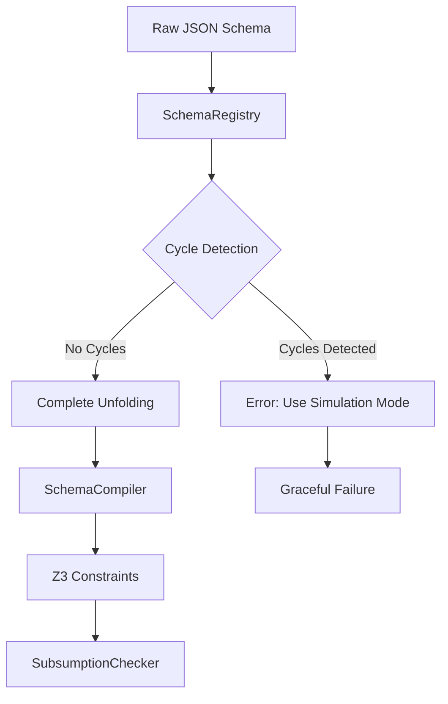

# K-Depth Unfolding Plan for $ref Resolution

## Overview

This document outlines a pragmatic implementation strategy for adding `$ref` support to jsound using **complete unfolding for acyclic schemas only**. This approach handles non-cyclic schemas perfectly by completely expanding all references, and **gives up gracefully** when cycles are detected (deferring to future simulation-based resolution).

The strategy serves as a stepping stone toward full simulation-based resolution, focusing on:
1. **Perfect acyclic handling**: Handle non-recursive schemas with complete correctness
2. **Clear separation**: Detect cycles and fail fast with informative errors
3. **Clean architecture**: Set up foundations for future simulation-based enhancement
4. **Incremental deployment**: Add `$ref` support without architectural overhaul

---

## 1. Problem Analysis

### Current State
- jsound has CLI parameter `--max-recursion-depth` but **zero implementation**
- Schema compiler ignores `$ref` completely
- Object/array constraints are stubbed
- No schema registry or reference resolution

### Target Scenarios

#### Scenario A: Acyclic References (Target: Perfect Resolution)
```json
{
  "$defs": {
    "Person": {
      "type": "object",
      "properties": {
        "name": {"type": "string"},
        "address": {"$ref": "#/$defs/Address"}
      }
    },
    "Address": {
      "type": "object",
      "properties": {
        "street": {"type": "string"},
        "city": {"type": "string"}
      }
    }
  },
  "type": "object",
  "properties": {
    "users": {
      "type": "array",
      "items": {"$ref": "#/$defs/Person"}
    }
  }
}
```

**Result**: ✅ Complete unfolding, perfect subsumption checking

#### Scenario B: Simple Recursion (Target: Graceful Failure)
```json
{
  "$defs": {
    "Node": {
      "type": "object",
      "properties": {
        "value": {"type": "integer"},
        "children": {
          "type": "array",
          "items": {"$ref": "#/$defs/Node"}
        }
      }
    }
  },
  "$ref": "#/$defs/Node"
}
```
**Result**: ❌ Cycle detected, clear error message suggesting simulation mode

#### Scenario C: Mutual Recursion (Target: Graceful Failure)
```json
{
  "$defs": {
    "A": {
      "type": "object",
      "properties": {
        "b_ref": {"$ref": "#/$defs/B"}
      }
    },
    "B": {
      "type": "object",
      "properties": {
        "a_ref": {"$ref": "#/$defs/A"}
      }
    }
  }
}
```
**Result**: ❌ Mutual recursion detected, clear error with cycle information

---

## 2. Technical Architecture

### 2.1 Core Components

```
┌─────────────────────┐
│   SchemaRegistry    │  ← New: URI resolution, cycle detection
├─────────────────────┤
│ UnfoldingProcessor  │  ← New: Complete expansion for acyclic schemas
├─────────────────────┤
│  SchemaCompiler     │  ← Enhanced: $ref case handling
├─────────────────────┤
│ SubsumptionChecker  │  ← Modified: integration point
└─────────────────────┘
```

### 2.2 Data Flow



---

## 3. Implementation Plan

### Phase 1: Schema Registry & Reference Resolution (Week 1-2)

#### 3.1 Schema Registry Implementation

**File**: `src/jsound/core/schema_registry.py`

```python
class SchemaRegistry:
    """Manages schema definitions and resolves $ref URIs."""

    def __init__(self, root_schema: dict):
        self.root_schema = root_schema
        self.definitions = self._extract_definitions(root_schema)
        self.ref_graph = self._build_reference_graph()
        self.cycles = self._detect_cycles()

    def resolve_ref(self, ref_uri: str) -> dict:
        """Resolve a $ref URI to its schema definition."""

    def has_cycles(self) -> bool:
        """Check if the schema has any reference cycles."""

    def get_cycle_info(self) -> Dict[str, List[str]]:
        """Return detailed cycle information for debugging."""

    def _extract_definitions(self, schema: dict) -> Dict[str, dict]:
        """Extract all $defs and definitions from schema."""

    def _build_reference_graph(self) -> Dict[str, Set[str]]:
        """Build directed graph of $ref dependencies."""
        
    def _detect_cycles(self) -> Dict[str, List[str]]:
        """Detect all cycles using Tarjan's algorithm."""
```

**Key Features**:
- Support for `#/$defs/Name` and `#/definitions/Name` patterns
- JSON Pointer resolution for complex paths
- Cycle detection using graph algorithms
- Clear error messages for unresolvable references

#### 3.2 Reference Graph Analysis

**Algorithm**: Modified Tarjan's strongly connected components
- **Input**: Reference dependency graph
- **Output**: List of strongly connected components (cycles)
- **Complexity**: O(V + E) where V = definitions, E = references

**Implementation Strategy**:
```python
def _detect_cycles(self) -> Dict[str, List[str]]:
    """
    Returns: {
        "cycle_1": ["#/$defs/Node", "#/$defs/Node/properties/children"],
        "cycle_2": ["#/$defs/A", "#/$defs/B"]
    }
    """
```

---

### Phase 2: Complete Unfolding Processor (Week 2-3)

#### 2.1 Simplified Unfolding Strategy

**File**: `src/jsound/core/unfolding_processor.py`

```python
class UnfoldingProcessor:
    """Handles complete unfolding of acyclic JSON schemas with $ref resolution."""
    
    def __init__(self, registry: SchemaRegistry):
        self.registry = registry
        self.unfolding_cache = {}
    
    def unfold_schema(self, schema: dict) -> dict:
        """Main entry point: unfold schema or fail if cycles detected."""
        if self.registry.has_cycles():
            cycle_info = self.registry.get_cycle_info()
            raise CyclicSchemaError(
                "Cyclic references detected. Use simulation-based resolution instead.",
                cycles=cycle_info
            )
        
        return self._complete_unfold(schema)
    
    def _complete_unfold(self, schema: dict) -> dict:
        """Completely expand all references (acyclic case only)."""
```

#### 2.2 Complete Unfolding Algorithm

##### Acyclic Schema Resolution
```python
def _complete_unfold(self, schema: dict) -> dict:
    """
    Strategy: Topological sort + substitution
    1. Topologically order definitions by dependencies  
    2. Substitute references in dependency order
    3. Result: Schema with zero $ref remaining
    
    Precondition: No cycles in reference graph
    Postcondition: Returned schema contains no $ref
    """
    if isinstance(schema, dict) and "$ref" in schema:
        ref_uri = schema["$ref"]
        
        # Check cache first
        if ref_uri in self.unfolding_cache:
            return self.unfolding_cache[ref_uri]
            
        # Resolve and recursively unfold
        resolved = self.registry.resolve_ref(ref_uri)
        unfolded = self._complete_unfold(resolved)
        
        # Cache result
        self.unfolding_cache[ref_uri] = unfolded
        return unfolded
    
    # Recursively process nested schemas
    return self._recursive_unfold_complete(schema)

def _recursive_unfold_complete(self, schema: dict) -> dict:
    """Recursively unfold all nested schema structures."""
    if not isinstance(schema, dict):
        return schema
        
    unfolded = {}
    for key, value in schema.items():
        if key == "$ref":
            # Should not reach here if cycle detection worked
            continue
        elif isinstance(value, dict):
            unfolded[key] = self._complete_unfold(value)
        elif isinstance(value, list):
            unfolded[key] = [self._complete_unfold(item) if isinstance(item, dict) else item 
                            for item in value]
        else:
            unfolded[key] = value
    
    return unfolded
```

#### 2.3 Error Handling for Cycles

**New Exception Class**:
```python
class CyclicSchemaError(Exception):
    """Raised when cyclic references are detected in unfolding-only mode."""
    
    def __init__(self, message: str, cycles: Dict[str, List[str]]):
        super().__init__(message)
        self.cycles = cycles
        
    def __str__(self):
        cycle_descriptions = []
        for cycle_id, cycle_refs in self.cycles.items():
            cycle_descriptions.append(f"  {cycle_id}: {' -> '.join(cycle_refs)}")
        
        return f"{super().__str__()}\n\nDetected cycles:\n" + "\n".join(cycle_descriptions) + \
               f"\n\nSuggestion: Use --ref-resolution-strategy=simulation for recursive schemas."
```

---

### Phase 3: Schema Compiler Integration (Week 3-4)

#### 3.1 Enhanced Schema Compiler

**File**: Modify `src/jsound/core/schema_compiler.py`

```python
class SchemaCompiler:
    def __init__(self, encoder: JsonEncoder, config: SolverConfig):
        self.encoder = encoder
        self.config = config
        self.registry = None  # Set during compilation
        self.unfolding_processor = None
    
    def compile_schema(self, schema: dict, variable: ExprRef) -> BoolRef:
        # NEW: Add $ref handling case
        if isinstance(schema, dict) and "$ref" in schema:
            # $ref should be resolved by unfolding processor before reaching here
            raise CompilerError(f"Unresolved $ref found: {schema['$ref']}")
        
        # Existing type handling logic...
```

#### 3.2 Preprocessing Pipeline

**Integration Point**: Modify `SubsumptionChecker.check_subsumption()`

```python
def check_subsumption(self, producer_schema: dict, consumer_schema: dict) -> SubsumptionResult:
    try:
        # NEW: Preprocessing phase
        producer_registry = SchemaRegistry(producer_schema)
        consumer_registry = SchemaRegistry(consumer_schema)
        
        producer_processor = UnfoldingProcessor(producer_registry)
        consumer_processor = UnfoldingProcessor(consumer_registry)
        
        # Attempt to unfold both schemas (will raise CyclicSchemaError if cycles found)
        unfolded_producer = producer_processor.unfold_schema(producer_schema)
        unfolded_consumer = consumer_processor.unfold_schema(consumer_schema)
        
        # Existing compilation logic with unfolded schemas
        return self._check_unfolded_subsumption(unfolded_producer, unfolded_consumer)
        
    except CyclicSchemaError as e:
        return SubsumptionResult(
            is_subsumed=None,  # Unknown due to cycles
            counterexample=None,
            error_message=str(e),
            requires_simulation=True
        )
```

---

### Phase 4: Missing Constraint Implementation (Week 4-5)

#### 4.1 Object Properties (Critical for $ref utility)

**Current Issue**: `_compile_object` returns `BoolVal(True)` (stub)

**Implementation**:
```python
def _compile_object(self, schema: dict, variable: ExprRef) -> BoolRef:
    constraints = []
    
    # Type constraint
    constraints.append(self.encoder.is_object(variable))
    
    # Properties constraints
    if "properties" in schema:
        for prop_name, prop_schema in schema["properties"].items():
            prop_var = self.encoder.get_object_property(variable, prop_name)
            prop_constraint = self.compile_schema(prop_schema, prop_var)
            
            # Property exists constraint
            has_prop = self.encoder.object_has_property(variable, prop_name)
            constraints.append(Implies(has_prop, prop_constraint))
    
    # Required properties
    if "required" in schema:
        for required_prop in schema["required"]:
            has_required = self.encoder.object_has_property(variable, required_prop)
            constraints.append(has_required)
    
    # Additional properties
    if "additionalProperties" in schema:
        additional_constraint = self._compile_additional_properties(
            schema["additionalProperties"], variable, schema.get("properties", {})
        )
        constraints.append(additional_constraint)
    
    return And(constraints)
```

#### 4.2 Array Items

```python
def _compile_array(self, schema: dict, variable: ExprRef) -> BoolRef:
    constraints = [self.encoder.is_array(variable)]
    
    # Items constraint
    if "items" in schema:
        items_schema = schema["items"]
        array_length = self.encoder.get_array_length(variable)
        
        # All items must satisfy items schema
        item_constraints = []
        for i in range(self.config.max_array_length):
            item_var = self.encoder.get_array_element(variable, i)
            item_constraint = self.compile_schema(items_schema, item_var)
            
            # Only apply if index is within actual array length
            within_bounds = i < array_length
            item_constraints.append(Implies(within_bounds, item_constraint))
        
        constraints.extend(item_constraints)
    
    # Length constraints
    if "minItems" in schema:
        min_length = IntVal(schema["minItems"])
        constraints.append(array_length >= min_length)
        
    if "maxItems" in schema:
        max_length = IntVal(schema["maxItems"])
        constraints.append(array_length <= max_length)
    
    return And(constraints)
```

---

### Phase 5: Testing & Validation (Week 5-6)

#### 5.1 Test Suite Structure

**File**: `tests/test_ref_unfolding.py`

```python
class TestRefUnfolding:
    """Test k-depth unfolding for various $ref patterns."""
    
    def test_acyclic_simple_ref(self):
        """Basic $ref resolution without cycles."""
        
    def test_acyclic_nested_refs(self):
        """Multiple levels of $ref in acyclic schema."""
        
    def test_acyclic_cross_references(self):
        """Complex acyclic reference patterns."""
        
    def test_cyclic_simple_recursion_error(self):
        """Verify proper error handling for basic recursive schemas."""
        
    def test_cyclic_mutual_recursion_error(self):
        """Verify proper error handling for mutual recursion."""
        
    def test_cyclic_detection_accuracy(self):
        """Verify cycle detection is accurate and complete."""
        
    def test_error_message_quality(self):
        """Verify error messages are helpful and actionable."""
```

#### 5.2 Integration Testing

**Test Cases**:
1. **OpenAPI Schemas**: Real-world API specifications with complex `$ref` patterns
2. **JSON Schema Test Suite**: Official test cases for reference resolution
3. **Performance Benchmarks**: Large schemas with varying recursion depths

#### 5.3 Error Handling Tests

```python
def test_unresolvable_ref(self):
    """Proper error for missing definitions."""
    
def test_circular_definition_detection(self):
    """Cycle detection accuracy."""
    
def test_max_depth_handling(self):
    """Behavior at recursion limits."""
```

---

## 4. Configuration & User Interface

### 4.1 CLI Enhancement

**File**: `src/jsound/cli/commands.py`

### 4.2 Enhanced Configuration Object

**File**: `src/jsound/core/__init__.py`

```python
@dataclass
class SolverConfig:
    # Existing fields...
    ref_resolution_strategy: str = 'unfold'  # 'unfold' | 'simulation'
    enable_ref_caching: bool = True
    fail_on_cycles: bool = True  # If False, would use bounded unfolding (future)

@dataclass
class SubsumptionResult:
    is_subsumed: Optional[bool]  # None if analysis failed
    counterexample: Optional[Any] = None
    error_message: Optional[str] = None
    requires_simulation: bool = False  # New: indicates cycles detected
```

### 4.3 Enhanced CLI with Clear Error Messages

```python
@click.option(
    "--ref-resolution-strategy",
    type=click.Choice(['unfold', 'simulation']),
    default='unfold', 
    help="Strategy for $ref: 'unfold' (acyclic only) or 'simulation' (supports cycles)"
)
@click.option(
    "--debug-refs", 
    is_flag=True,
    help="Show detailed $ref resolution information"
)
def check_subsumption(producer_file, consumer_file, ref_resolution_strategy, debug_refs, **kwargs):
    """Enhanced CLI with $ref options."""
    # ... existing logic ...
    
    result = checker.check_subsumption(producer_schema, consumer_schema)
    
    if result.requires_simulation:
        click.echo("❌ Cyclic references detected!", err=True)
        click.echo(result.error_message, err=True)
        click.echo("\n💡 Try again with --ref-resolution-strategy=simulation", err=True)
        raise click.Abort()
        
    # ... handle normal results ...
```

---

## 5. Performance Considerations

### 5.1 Simplified Caching Strategy

**Unfolding Cache**: Memoize expanded schemas
```python
class UnfoldingProcessor:
    def __init__(self, registry: SchemaRegistry):
        self.unfolding_cache = {}  # ref_uri -> fully_expanded_schema
        # No need for cycle cache since we fail fast
```

**Benefits**:
- Avoid re-expanding identical `$ref` targets
- Significant speedup for schemas with repeated references
- Simpler memory management (no bounded expansion complexity)

### 5.2 Early Cycle Detection

**Optimization**: Detect cycles before any unfolding work
```python
def unfold_schema(self, schema: dict) -> dict:
    # Fail fast if cycles detected
    if self.registry.has_cycles():
        raise CyclicSchemaError(...)
    
    # Only do expensive unfolding work if guaranteed to succeed
    return self._complete_unfold(schema)
```

### 5.3 Memory Management Benefits

**Advantages of No Bounded Unfolding**:
- No risk of exponential expansion (complete unfolding is finite for acyclic graphs)
- No complex approximation logic
- Predictable memory usage
- Simpler garbage collection

---

## 6. Limitations & Future Work

### 6.1 Current Scope Limitations

**Explicit Non-Support**:
- **Recursive schemas**: Detected and rejected with clear error messages
- **Mutual recursion**: Detected and rejected with cycle information
- **Self-references**: Any form of `$ref` cycle is rejected

**Supported Features**:
- JSON Pointer resolution for `#/$defs/Name` and `#/definitions/Name` patterns
- Complex acyclic reference graphs with any depth
- Cross-references between definitions (as long as acyclic)

### 6.2 Clear Migration Path to Simulation

This unfolding-only approach provides perfect migration to simulation:

1. **Schema Registry**: Already builds reference graphs needed for simulation
2. **Cycle Detection**: Provides exact cycle information for simulation analysis
3. **Error Messages**: Guide users toward simulation mode
4. **Configuration**: Strategy parameter enables seamless mode switching

**Future Enhancement** (simulation mode):
```python
def check_subsumption(self, producer_schema: dict, consumer_schema: dict) -> SubsumptionResult:
    if self.config.ref_resolution_strategy == 'simulation':
        # Use coinductive simulation approach for all schemas
        return self._simulation_based_subsumption(producer, consumer)
    else:
        # Use complete unfolding (current implementation)
        return self._unfolding_based_subsumption(producer, consumer)
```

---

## 7. Success Criteria

### 7.1 Functional Requirements

✅ **Perfect Acyclic Schema Support**:
- All non-recursive `$ref` patterns resolve correctly
- Complete subsumption checking with zero false positives/negatives
- Handle complex acyclic reference graphs of any size

✅ **Reliable Cycle Detection**:
- Accurate identification of all reference cycles
- Clear, informative error messages with cycle details
- Helpful guidance toward simulation mode

✅ **Clean Integration**:
- No regression in existing functionality
- Graceful fallback behavior for unsupported cases
- Clear separation between unfolding and simulation modes

### 7.2 Performance Targets

- **Small Acyclic Schemas** (< 10 definitions): < 50ms resolution time
- **Medium Acyclic Schemas** (10-50 definitions): < 500ms resolution time  
- **Large Acyclic Schemas** (50+ definitions): < 5s resolution time
- **Cycle Detection**: < 100ms for any schema size

### 7.3 Error Quality Targets

- **Cycle Detection Accuracy**: 100% precision and recall
- **Error Message Clarity**: Users understand exactly what cycles exist
- **Migration Guidance**: Clear path to simulation mode for recursive schemas

---

## 8. Implementation Timeline

### Week 1-2: Foundation & Cycle Detection
- [ ] Schema Registry implementation with robust cycle detection
- [ ] Reference graph construction using Tarjan's algorithm
- [ ] Basic URI resolution for `#/$defs/Name` and `#/definitions/Name`
- [ ] Comprehensive cycle detection testing

### Week 2-3: Complete Unfolding Logic  
- [ ] Complete unfolding algorithm for acyclic schemas
- [ ] Unfolding cache implementation
- [ ] CyclicSchemaError exception with detailed information
- [ ] Recursive schema structure handling

### Week 3-4: Integration & Error Handling
- [ ] Schema compiler `$ref` case handling
- [ ] SubsumptionChecker preprocessing with error handling
- [ ] Enhanced CLI with clear error messages
- [ ] Object properties and array items implementation

### Week 4-5: Testing & Validation
- [ ] Comprehensive test suite for acyclic schemas
- [ ] Cycle detection accuracy tests
- [ ] Error message quality validation
- [ ] Performance benchmarking

### Week 5-6: Documentation & Polish
- [ ] User documentation with examples
- [ ] Migration guide for simulation mode
- [ ] Performance optimization
- [ ] Final integration testing

---

## 9. Risk Assessment

### Low Risk: Acyclic Schema Handling
**Issue**: Complete unfolding is well-understood for acyclic graphs
**Confidence**: High - standard topological sorting approach

### Low Risk: Cycle Detection
**Issue**: Tarjan's algorithm is well-established
**Confidence**: High - extensively tested in graph theory

### Medium Risk: User Experience
**Issue**: Users might be frustrated by cycle rejection
**Mitigation**: Excellent error messages, clear migration path

---

This simplified plan focuses exclusively on perfect acyclic schema handling while providing a clean foundation for future simulation-based recursive schema support. The clear separation of concerns makes both the current implementation and future enhancements more maintainable.
